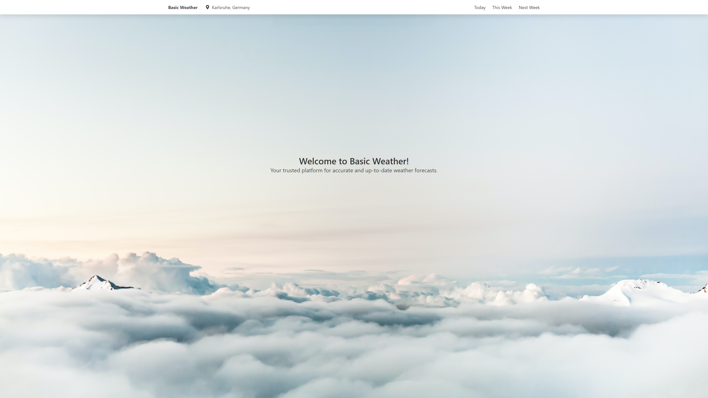

# 🌤️ Basic Weather Web Application

A sleek and modern weather web application that provides accurate weather forecasts using the **[Nominatim Geocoding API](https://nominatim.org/release-docs/develop/api/Overview/)** and **[OpenWeatherMap API](https://openweathermap.org/api)**. This project was developed as part of the **[Mobile Computing and Internet of Things](https://pcs.tm.kit.edu/962_984.php)** course at Karlsruhe Institute of Technology.

## Features

- 🌍 **Geocoding**: Automatically detects your location using the Nominatim API.
- ☀️ **Current Weather**: Displays today's weather conditions, including temperature, humidity, and more.
- 📅 **Weekly Forecast**: Provides a detailed weather forecast for the current and upcoming weeks.
- 🔄 **Responsive Design**: Fully optimized for desktop and mobile devices.

## Preview

### Desktop



## Installation and Setup

Follow these steps to run the project locally:

### Prerequisites

- [Node.js](https://nodejs.org/) (v16 or later)
- [Angular CLI](https://angular.io/cli) (v15 or later)

### Steps

1. **Clone the repository**:

    ```bash
    git clone https://github.com/holtvogt/basic-weather-web.git
    cd basic-weather-web
    ```

2. **Install dependencies**:

    ```bash
    npm install
    ```

3. **Start the development server**:

    ```bash
    ng serve
    ```

4. **Access the application**:

    Open your browser and navigate to [http://localhost:4200](http://localhost:4200).
